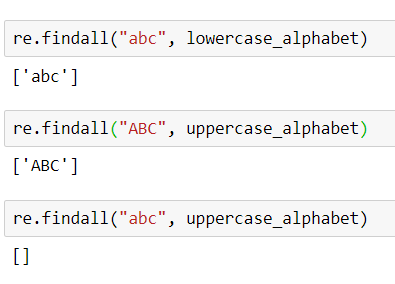
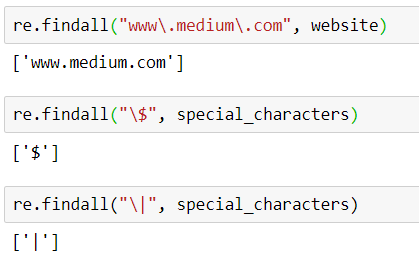
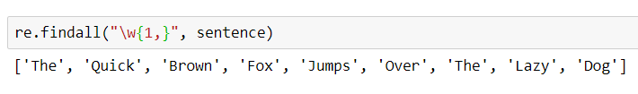
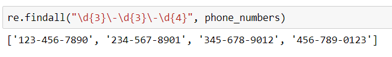

# Regular Expressions Tutorial With Jupyter Notebooks
Learning regex may sound daunting and difficult at first glance. Looking at the different strings and wondering what it all means. In this blog post we will go over some exercises and examples so learning regex does not look scary.

## What is Regex?
> A regular expression, regex or regexp (sometimes called a rational expression) is a sequence of characters that define a search pattern. Usually such patterns are used by string searching algorithms for "find" or "find and replace" operations on strings, or for input validation. It is a technique developed in theoretical computer science and formal language theory. 
> 
> -[wikipedia](https://en.wikipedia.org/wiki/Regular_expression)

## Jupyter Notebook Examples
I have created a project on github where you can follow the examples and it can also serve as a starting point in your regex learning  journey. [here](https://github.com/KennyMiyasato/regex_blog_post)

## How do I use regex for my projects in my Jupyter Notebook?
Since Jupyter Notebooks use Python, we can `import re` and we can start using regex.

## Sample strings we will be using
```
lowercase_alphabet = "abcdefghijklmnopqrstuvwxyz"
uppercase_alphabet = lowercase_alphabet.upper()
numbers = "1234567890"
sentence = "The Quick Brown Fox Jumps Over The Lazy Dog"
website = "www.medium.com"
phone_numbers = """123-456-7890
                    987.654.321
                    234-567-8901
                    654.321.987
                    345-678-9012
                    321.654.978
                    456-789-0123
                """
special_characters = "[\^$.|?*+()"
```

## Matching explicit characters


In order to match characters explicitly, all you need to do is type what you'd like to find. Similarly to `ctrl+f` on any application.

## Matching literal characters


In order to match any literal characters ( *any character except `[\^$.|?*+()`* ) you have first introduce a backslash `\` followed by the character you'd like to select.

## Matching by pattern
There are a lot of ways we can match a pattern. Regex has its own syntax so we could pick and choose how we want our patterns to look like.

### Character Classes
| Class | Explanation |
|---|---|
| . | any character except newline |
| \w \d \s | word, digit, whitespace |
| \W \D \S | not word, digit, whitespace |
| [abc] | any of a, b, or c |
| [^abc] | note a, b, or c |
| [a-g] | characters between a & g |

### Anchors
| Class | Explanation |
|---|---|
| ^abc$ | start / end of the string |
| \b \B | character between a & g |

### Escaped Characters
| Class | Explanation |
|---|---|
| \\. \\* \\\ | escaped special characters |
| \\t \\n \\r | tab, linefeed, carriage return |

### Groups & Lookaround
| Class | Explanation |
|---|---|
| (abc) | capture group |
| \1 | backreference to group #1 |
| (?:abc) | non-capturing group |
| (?=abc) | positive lookahead |
| (?!abc) | negative lookahead |

### Quantifiers & Alternation
| Class | Explanation |
|---|---|
| a* a+ a? | 0 or more, 1 or more, 0 or 1 |
| a{5} a{2,} | exactly five, two or more |
| a{1,3} | between one & three |
| a+? a{2,}? | match as few as possible |
| ab\|cd | match ab or cd |
> [Tables from: regexr.com](https://regexr.com/)

## Examples

Say for instance we want to match every word from this sentence and put it in a list: `The Quick Brown Fox Jumps Over The Lazy Dog` How would we do it?


`\w` = any word

`{1,}` = 1 or more characters

Translation: `\w{1,}` *match [any word] with [1 or more characters] and put each word matched in a list*

How about if we want to select only the phone numbers that are the following format? `xxx-xxx-xxxx`


`\d` = any digit

`{3}` = exactly three

`\-` = select hyphen

`\d` = any digit

`{3}` = exactly three

`\-` = select hyphen

`\d` = any digit

`{4}` = exactly four

Translation: `\d{3}\-\d{3}\-\d{4}` * match [any digit] with [exactly three characters] followed by [hyphen] match [any digit] with [exactly three characters] followed by [hyphen] match [any digit] with [exactly four characters]

## Resoureces:
https://www.guru99.com/python-regular-expressions-complete-tutorial.html

https://www.regular-expressions.info/refcharacters.html

https://docs.python.org/3/library/re.html

https://www.dataquest.io/blog/regular-expressions-data-scientists/

https://www.youtube.com/watch?v=sa-TUpSx1JA